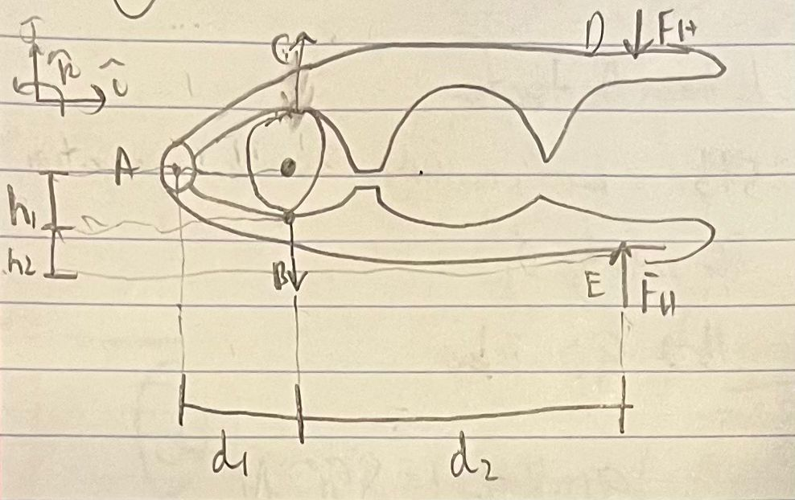

## Find
Determine the key dimensions of a handheld nutcracker design—specifically:
- Handle length / overall geometry
- Pin (hinge) location (lever arms)
- Jaw location relative to the pin  
such that a user can apply a realistic grip force and still crack a macadamia nut.

## Given
Image of the nutcracker. Given advice to find size of macademia nut, average human grip strength, and to determine necessary load to break a macademia nut.

## Plan:
1. Find nut size
2. Find average human grip strength
3. Determine necessary load to crack a macademia nut
4. Draw FBD of the nutcracker
5. Determine summation of moments about point A (see free body diagram below) 

## Calculations and Assumptions
1. Estimated nut diameter:
   - $h_1 \approx 10 \text{ mm}$

2. Distance from pin to nut load location:
   - $d_1 \approx 20 \text{ mm}$

3. Average human grip strength:
   - Approx. 30 kg total grip  
   - Per handle (assuming symmetry):
     $ F_h = \frac{30}{2} = 15 \text{ kg}$

   - Converting to Newtons:

     $F_h = 15(9.81) \approx 147 \text{ N}$

4. Required cracking force for macadamia nut:
   - Estimated total compressive load $\approx 2000 \text{ N}$
   - Per jaw (assuming equal distribution):

     $C = \frac{2000}{2} = 1000 \text{ N}$

### Moment Balance About Point A

Using the free body diagram and summing moments about the pin at point A:

$$
\sum M_A = 0
$$

$$
C(d_1) - F_h(d_2) = 0
$$

Solving for handle length $d_2$:

$$
d_2 = \frac{C d_1}{F_h}
$$

Substituting values:

$$
d_2 = \frac{1000(20 \text{ mm})}{147}
$$

$$
d_2 \approx 136 \text{ mm}
$$

## Design Result

- Distance from pin to nut contact: $d_1 \approx 20 \text{ mm}$
- Required handle lever arm: $d_2 \approx 136 \text{ mm}$
- Nut thickness accommodated: $h_1 \approx 10 \text{ mm}$
- Estimated handle clearance: $h_2 \approx 10 \text{ cm}$

Mechanical advantage:

$$
MA = \frac{d_2}{d_1} \approx \frac{136}{20} \approx 6.8
$$

This means the user's applied grip force is amplified by nearly $7\times$ at the nut.

## Discussion on Usability

The calculated handle length of approximately 136 mm is within a comfortable handheld range for a typical adult user. The short jaw lever arm (20 mm) provides strong mechanical advantage but increases reaction forces at the pin, meaning the hinge should be made from a durable material to prevent wear or deformation over time.

The estimated 10 mm nut diameter fits within the jaw opening. However, manufacturing tolerances should allow slightly larger clearance to accommodate natural variation in nut sizes.

Overall, the geometry appears physically realistic for a typical manual nutcracker.